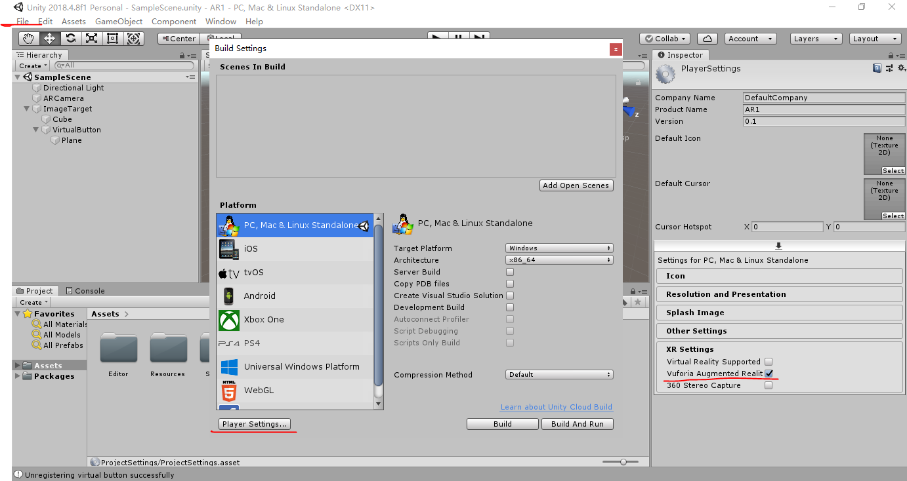
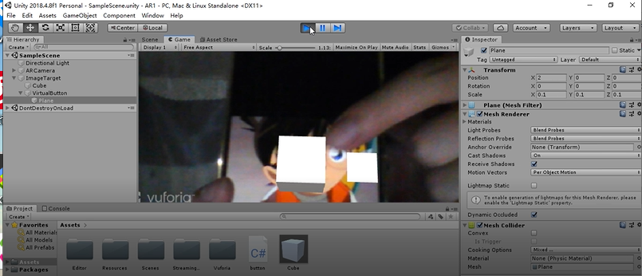
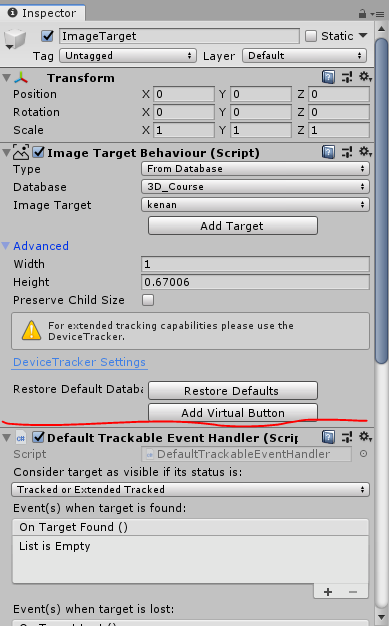
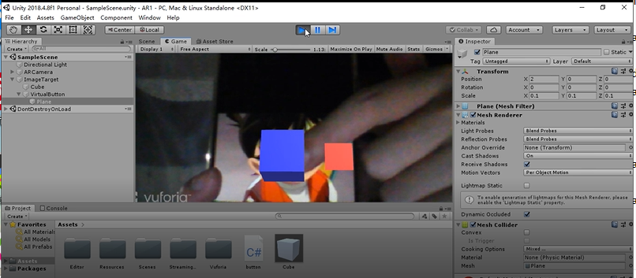
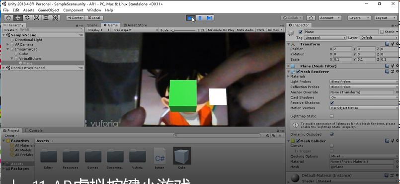

#### 图像识别与建模

首先是按照课件的内容，把vuforia对应的内容先完成，然后导入到unity中确保unity中可以使用AR Camera

然而已经按照课件的内容导入AR Camera，但是仍然有可能无法使用摄像头，需要进行如下操作



然后就能使用摄像头了。

添加一个Image Target

简单挂载一个cube到Image Target下，手机中打开在voforia中处理的图片。效果如下



上面的都顺利的话，接下来就可以进行虚拟小游戏的

#### 虚拟按键小游戏

添加Virtual Button,比较隐蔽，



然后Image Target下就自动出现一个VirtualButton，然后如下脚本挂载到VirtualButton下

```c#
using System.Collections;
using System.Collections.Generic;
using UnityEngine;
using System;
using Vuforia;

public class button : MonoBehaviour, IVirtualButtonEventHandler
{
    // Start is called before the first frame update
    public VirtualButtonBehaviour[] vbs;
    public GameObject cub;
    public GameObject but;
    public Color[] colors;
    public int color_index;

    void Start()
    {
        vbs = GetComponentsInChildren<VirtualButtonBehaviour>();
        for (int i = 0; i < vbs.Length; i++)
        {
            vbs[i].RegisterEventHandler(this);
        }
        color_index = 1;
        colors = new Color[4];
        colors[0] = Color.white;
        colors[1] = Color.yellow;
        colors[2] = Color.blue;
        colors[3] = Color.green;
        cub = GameObject.Find("ImageTarget/Cube");
        but = GameObject.Find("ImageTarget/VirtualButton/Plane");
    }

    // Update is called once per frame
    void Update()
    {
       
       
    }

    public void OnButtonPressed(VirtualButtonBehaviour vb)
    {
        but.GetComponent<Renderer>().material.color = Color.red;
        if (color_index == 4) color_index = 0;
        cub.GetComponent<Renderer>().material.color = colors[color_index++];
    }

    public void OnButtonReleased(VirtualButtonBehaviour vb)
    {
        but.GetComponent<Renderer>().material.color = Color.white;
    }
}
```

上面这段代码能跑还要在VirtualButton下添加一个Plane，为了显示VirtualButton按下时显示红色，松开时显示白色。

效果：





这样一个按键改变物体颜色的小游戏就完成了。