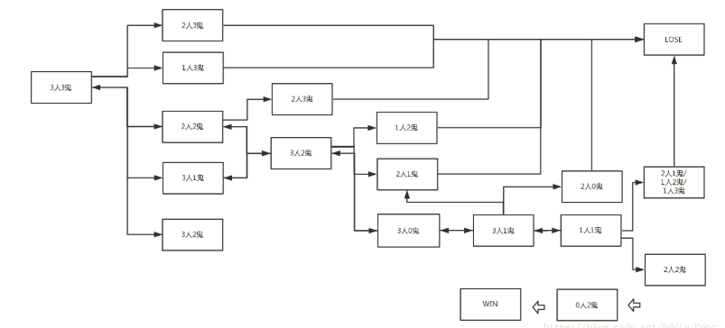
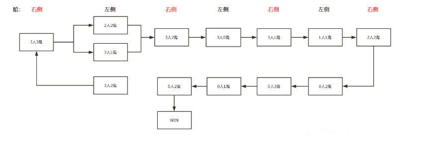
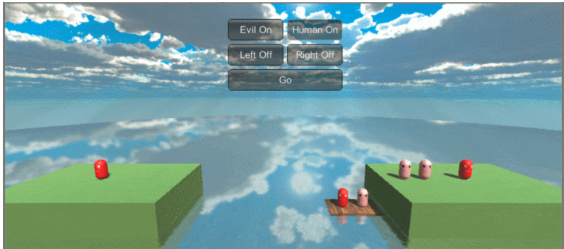
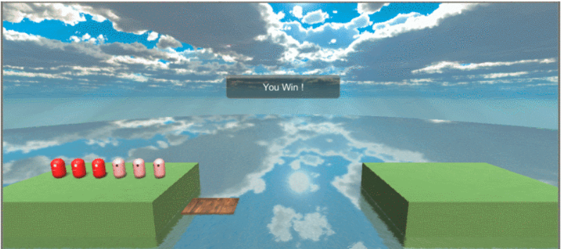

### hw10-AR版P&D

#### 简介

实现以前写过的作业，增加下一步的操作，也就是执行到某一个状态时判断下一步最优。

首先先要画出状态图：



每一次箭头的移动代表船从一边移动到另一边，初始位置是右边，但是很多情况都是导致输掉游戏，所以有些路我们是不能走的，所以要进行剪枝：



所以我们得到如下的最优解，所以剩下的工作就是用户每次请求下一步状态的时候我们先判断现在的状态，然后，根据状态图进行下一步移动。

具体实现如下：

**Step 1.** 在GenGameObject类（创建游戏对象和处理对象运动）中，定义枚举类型act，添加两个枚举型矩阵，分别记录船在左右两岸时不同的游戏状态下的下一步执行操作标记。使用矩阵（状态表）的目的是表达清晰，方便更改维护，且能减少逻辑判断复杂度。
act枚举说明：L（R）表示左岸（右岸）的人物进行上船操作，E表示魔鬼上船，H表示人类（牧师）上船，HE表示1人1鬼上船，HH表示2人上船，EE表示2鬼上船，x代表对应状态不存在或是该状态下游戏结束（失败或胜利）。
[贴一张状态表图片]

```C#
    // AI次状态表，以枚举型矩阵形式存储
    private enum act { LH, LE, LHE, RHE, RHH, REE , x};
    private act[,] matLeft = new act[4, 4] {{ act.x, act.LE, act.LE, act.x },
                                            { act.x, act.LHE, act.x, act.x },
                                            { act.x, act.x, act.LH, act.x },
                                            { act.LE, act.LE, act.LE, act.x }};
    private act[,] matRight = new act[4, 4] {{ act.x, act.x, act.REE, act.REE },
                                            { act.x, act.x, act.x, act.x },
                                            { act.x, act.x, act.RHH, act.x },
                                            { act.x, act.RHH, act.REE, act.RHE }};
```

**Step 2. **同样在GenGameObject类中，设计自动执行最优解步骤的函数（仅上船操作）

```c#
    // 自动执行最优解步骤
    public void AutoAct()
    {
        int h = HumansOnRight.Count;
        int e = EvilsOnRight.Count;
        if (side == 0)
        {
            // 船在左侧，右岸增员
            act nextMove = matLeft[h, e];
            switch (nextMove)
            {
                case act.LE:
                    GetOn(EvilsOnLeft.Pop());
                    break;
                case act.LH:
                    GetOn(HumansOnLeft.Pop());
                    break;
                case act.LHE:
                    GetOn(HumansOnLeft.Pop());
                    GetOn(EvilsOnLeft.Pop());
                    break;
                default:
                    break;
            }
        }
        else if (side == 1)
        {
            // 船在右侧，右岸减员
            act nextMove = matRight[h, e];
            switch (nextMove)
            {
                case act.REE:
                    GetOn(EvilsOnRight.Pop());
                    GetOn(EvilsOnRight.Pop());
                    break;
                case act.RHH:
                    GetOn(HumansOnRight.Pop());
                    GetOn(HumansOnRight.Pop());
                    break;
                case act.RHE:
                    GetOn(EvilsOnRight.Pop());
                    GetOn(HumansOnRight.Pop());
                    break;
                default:
                    break;
            }
        }
    }
```

**Step 3.** 更改UI界面以及AutoNext的相应操作

```c#
if (GUI.Button(new Rect(x + width + 5f, (height + 5f) * 2 + y, width, height), "AutoNext"))
                {
                    // 先使船上的任务上岸，便于判断当前游戏状态
                    action.LeftOff();
                    action.RightOff();
                    // 选择最优解，相应人物上船
                    action.Auto();
                    action.BoatMove();
                    action.LeftOff();
                    action.RightOff();
                }
```

**Step 4. **更新BaseCode类中的函数接口

#### 效果截图





#### 代码&视频

同目录下