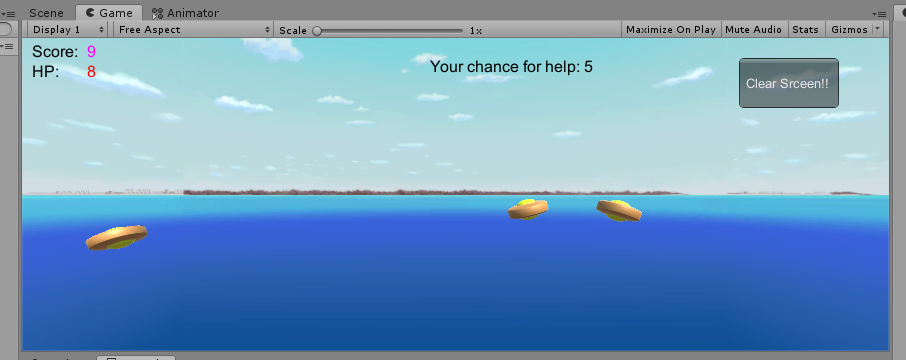

## HW5

### 介绍



这次的作业是完成打飞碟的游戏，由于上一次的作业并没有用到动作管理等基类，所以这次的作业可谓是一言难尽。首先不得不说参考了群里的优秀博客，看了很久以后大概了解了各种类之间的协作关系。但是奈何别人做得太好自己又没能写出来。。。所以直接拿优秀的代码直接进行修改。。。

代码的主要结构：

#### Model(DiskData.cs)

```c#
using System.Collections;
using System.Collections.Generic;
using UnityEngine;

public class DiskData : MonoBehaviour
{
    public int score = 0;                             
    public Color color = Color.white;                
    public Vector3 direction;                    
    public Vector3 scale = new Vector3( 1 ,0.25f, 1);   
}
```

#### Controller(FirstController.cs)

```c#
using System.Collections;
using System.Collections.Generic;
using UnityEngine;

public class FirstController : MonoBehaviour, ISceneController, IUserAction
{
    public FlyActionManager action_manager;
    public DiskFactory disk_factory;
    public UserGUI user_gui;
    public ScoreRecorder score_recorder;

    private Queue<GameObject> disk_queue = new Queue<GameObject>();          //游戏场景中的飞碟队列
    private List<GameObject> disk_notshot = new List<GameObject>();          //没有被打中的飞碟队列
    private int round = 1;   //回合
    private float speed = 2f;   //发射一个飞碟的时间间隔
    private bool playing_game = false;  //游戏中
    private bool game_over = false;    //游戏结束
    private bool game_start = false;  //游戏开始
    private int score_round2 = 10;   //去到第二回合所需分数
    private int score_round3 = 25;//去到第三回合所需分数
    private int last_record = 0; // 上一次的分数
    void Start ()
    {
        SSDirector director = SSDirector.GetInstance();     
        director.CurrentScenceController = this;             
        disk_factory = Singleton<DiskFactory>.Instance;
        score_recorder = Singleton<ScoreRecorder>.Instance;
        action_manager = gameObject.AddComponent<FlyActionManager>() as FlyActionManager;
        user_gui = gameObject.AddComponent<UserGUI>() as UserGUI;
    }
	
	void Update ()
    {
        if(game_start)
        {
            //游戏结束，取消定时发送飞碟
            if (game_over)
            {
                CancelInvoke("LoadResources");
            }
            //设定一个定时器，发送飞碟，游戏开始
            if (!playing_game)
            {
                InvokeRepeating("LoadResources", 1f, speed);
                playing_game = true;
            }
            //发送飞碟
            SendDisk();
            //回合升级
            // if (score_recorder.score >= score_round2 && round == 1)
            // {
            //     round = 2;
            //     //缩小飞碟发送间隔
            //     speed = speed - 0.6f;
            //     CancelInvoke("LoadResources");
            //     playing_game = false;
            // }
            // else if (score_recorder.score >= score_round3 && round == 2)
            // {
            //     round = 3;
            //     speed = speed - 0.5f;
            //     CancelInvoke("LoadResources");
            //     playing_game = false;
            // }
            if (last_record != score_recorder.score){
                last_record = score_recorder.score;
                CancelInvoke("LoadResources");
                if (speed > 0.5f) speed = speed - 0.25f;
                else speed = 0.5f;
                playing_game = false;
            }
        }
    }

    public void LoadResources()
    {
        float index = Random.Range(0.0f,3.0f);
        if (index <= 1.0f) disk_queue.Enqueue(disk_factory.GetDisk(1)); 
        else if (index <= 2.0f) disk_queue.Enqueue(disk_factory.GetDisk(2));
        else disk_queue.Enqueue(disk_factory.GetDisk(3));
    }

    private void SendDisk()
    {
        float position_x = 16;                       
        if (disk_queue.Count != 0)
        {
            GameObject disk = disk_queue.Dequeue();
            disk_notshot.Add(disk);
            disk.SetActive(true);
            //设置被隐藏了或是新建的飞碟的位置
            float ran_y = Random.Range(-2f, -4f);
            // float ran_x = 0;
            float ran_x = Random.Range(-1f, 1f) < 0 ? -1.2f : 1.2f;
            disk.GetComponent<DiskData>().direction = new Vector3(ran_x, ran_y, 0);
            Vector3 position = new Vector3(-disk.GetComponent<DiskData>().direction.x * position_x, ran_y, 0);
            disk.transform.position = position;
            //设置飞碟初始所受的力和角度
            float power = Random.Range(10f, 15f);
            float angle;
            if (ran_x > 0) angle = Random.Range(20f, 30f);
            else angle = Random.Range(150f,160f);
            action_manager.UFOFly(disk,angle,power);
        }

        for (int i = 0; i < disk_notshot.Count; i++)
        {
            GameObject temp = disk_notshot[i];
            //飞碟飞出摄像机视野也没被打中
            if (temp.transform.position.y < -10 && temp.gameObject.activeSelf == true)
            {
                disk_factory.FreeDisk(disk_notshot[i]);
                disk_notshot.Remove(disk_notshot[i]);
                //玩家血量-1
                user_gui.ReduceBlood();
            }
        }
    }

    public void Hit(Vector3 pos)
    {
        Ray ray = Camera.main.ScreenPointToRay(pos);
        RaycastHit[] hits;
        hits = Physics.RaycastAll(ray);
        bool not_hit = false;
        for (int i = 0; i < hits.Length; i++)
        {
            RaycastHit hit = hits[i];
            //射线打中物体
            if (hit.collider.gameObject.GetComponent<DiskData>() != null)
            {
                //射中的物体要在没有打中的飞碟列表中
                for (int j = 0; j < disk_notshot.Count; j++)
                {
                    if (hit.collider.gameObject.GetInstanceID() == disk_notshot[j].gameObject.GetInstanceID())
                    {
                        not_hit = true;
                    }
                }
                if(!not_hit)
                {
                    return;
                }
                disk_notshot.Remove(hit.collider.gameObject);
                //记分员记录分数
                score_recorder.Record(hit.collider.gameObject);
                //显示爆炸粒子效果
                Transform explode = hit.collider.gameObject.transform.GetChild(0);
                explode.GetComponent<ParticleSystem>().Play();
                //等0.1秒后执行回收飞碟
                StartCoroutine(WaitingParticle(0.08f, hit, disk_factory, hit.collider.gameObject));
                break;
            }
        }
    }
    //获得分数
    public int GetScore()
    {
        return score_recorder.score;
    }
    //重新开始
    public void ReStart()
    {
        game_over = false;
        playing_game = false;
        score_recorder.score = 0;
        round = 1;
        speed = 2f;
    }
    //设定游戏结束
    public void GameOver()
    {
        game_over = true;
    }
    //暂停几秒后回收飞碟
    IEnumerator WaitingParticle(float wait_time, RaycastHit hit, DiskFactory disk_factory, GameObject obj)
    {
        yield return new WaitForSeconds(wait_time);
        //等待之后执行的动作  
        hit.collider.gameObject.transform.position = new Vector3(0, -9, 0);
        disk_factory.FreeDisk(obj);
    }
    public void BeginGame()
    {
        game_start = true;
    }
	// clear all the disk
    public void ClearAll(){
        for (int i = 0; i < disk_notshot.Count; i++)
        {
            disk_factory.FreeDisk(disk_notshot[i]);   
        }
    }
}

```

#### View(UserGUI.cs)

```c#
using System.Collections;
using System.Collections.Generic;
using UnityEngine;

public class UserGUI : MonoBehaviour
{
    private IUserAction action;
    public int life = 10 ;                   //血量
    //每个GUI的style
    GUIStyle bold_style = new GUIStyle();
    GUIStyle score_style = new GUIStyle();
    GUIStyle text_style = new GUIStyle();
    GUIStyle over_style = new GUIStyle();
    private int high_score = 0;            //最高分
    private bool game_start = false;       //游戏开始
    private int help_count = 5;

    void Start ()
    {
        action = SSDirector.GetInstance().CurrentScenceController as IUserAction;
    }
	
	void OnGUI ()
    {
        bold_style.normal.textColor = new Color(1, 0, 0);
        bold_style.fontSize = 16;
        text_style.normal.textColor = new Color(0,0,0, 1);
        text_style.fontSize = 16;
        score_style.normal.textColor = new Color(1,0,1,1);
        score_style.fontSize = 16;
        over_style.normal.textColor = new Color(1, 0, 0);
        over_style.fontSize = 25;

        if (game_start)
        {
            //用户射击
            if (Input.GetButtonDown("Fire1"))
            {
                Vector3 pos = Input.mousePosition;
                action.Hit(pos);
            }

            GUI.Label(new Rect(10, 5, 50, 50), "Score:", text_style);
            GUI.Label(new Rect(65, 5, 50, 50), action.GetScore().ToString(), score_style);

            //显示当前血量
            GUI.Label(new Rect(10, 25, 50, 50), "HP:", text_style);
            GUI.Label(new Rect(65, 25, 50, 50), life.ToString(), bold_style);

            if (GUI.Button(new Rect(Screen.width - 150, 20, 100, 50), "Clear Srceen!!")){
                if (help_count > 0) {
                    action.ClearAll();
                    ReduceHelpCount();
                }
            }
            GUI.Label(new Rect(Screen.width / 2 - 25, 20, 100, 50), "Your chance for help: " + help_count.ToString(), text_style);
    
            //游戏结束
            if (life == 0)
            {
                high_score = high_score > action.GetScore() ? high_score : action.GetScore();
                GUI.Label(new Rect(Screen.width / 2 - 50, Screen.height / 2 - 100, 100, 50), "游戏结束", over_style);
                GUI.Label(new Rect(Screen.width / 2 - 50, Screen.height / 2 - 50, 50, 50), "最高分:", text_style);
                GUI.Label(new Rect(Screen.width / 2 + 20, Screen.height / 2 - 50, 50, 50), high_score.ToString(), text_style);
                if (GUI.Button(new Rect(Screen.width / 2 - 50, Screen.height / 2 , 100, 50), "重新开始"))
                {
                    life = 6;
                    action.ReStart();
                    return;
                }
                action.GameOver();
            }
        }
        else
        {
            if (GUI.Button(new Rect(Screen.width / 2 - 50, Screen.height / 2-25, 100, 50), "游戏开始"))
            {
                game_start = true;
                action.BeginGame();
            }
        }
    }
    public void ReduceBlood()
    {
        if(life > 0)
            life--;
    }

    public void ReduceHelpCount(){
        if (help_count > 0) -- help_count;
    }
}
```

我觉得优秀博客的分析肯定比我到位，所以我着重讲讲我做的改变吧。

- 预制

原作者的飞碟是圆柱体，我这里加了一个胶囊组成生成另一个预制。（无关紧要。。。）

- 阶段升级

原作是分3个阶段，而且每个阶段所用的预制是不一样的，分别为disk1、disk2、disk3，我这里只用一个预制，也就是只有一种飞碟，但是阶段升级更快，每得多1分难度都要提高一点点，直到达到阈值。

```c#
if (last_record != score_recorder.score){
    last_record = score_recorder.score;
    CancelInvoke("LoadResources");
    if (speed > 0.5f) speed = speed - 0.25f;
    else speed = 0.5f;
    playing_game = false;
}
```

- 增加ClearAll按钮

由于后期难度实在太大，因此有点像水果忍者的感觉，所以适当提高了HP（血量），而且提供多次的清屏机会，将所有飞碟清空。

```c#
public void ClearAll(){
    for (int i = 0; i < disk_notshot.Count; i++)
    {
        disk_factory.FreeDisk(disk_notshot[i]);   
    }
}
```

- 飞碟的发射位置和方向改变

### 总结

个人觉得难点在于对于飞碟的动作的管理，资源的回收和管理，以及按照高内聚低耦合的结构去完成设计。

## [代码&视频]()