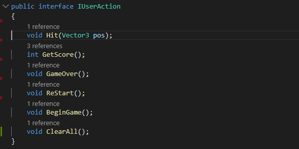
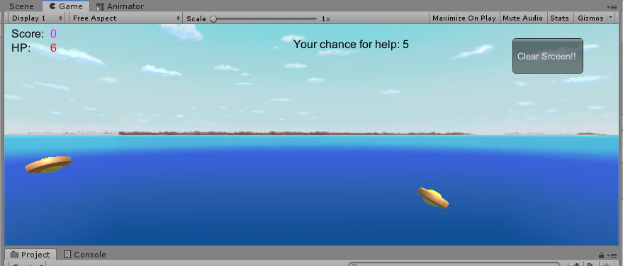
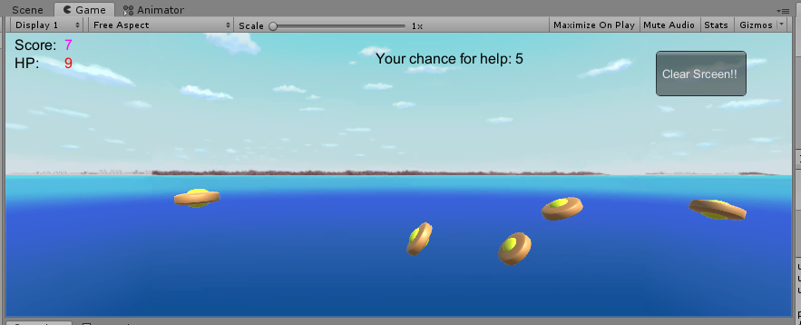

### 改进UFO游戏

#### 按 *adapter模式* 设计图修改飞碟游戏

首先先说一下adapter模式，翻译过来是适配器模式，系统分析与设计中学过，这个模式是对于一些很多方法的类库，我们需要实现一个给用户使用的但是比较简洁的能实现整个功能的系统，这样我们就可以建立一个接口，里面就是对类库的用到的方法进行调用，这样我们就可以通过调用这个类库实现多个适配器（不同功能），而且每次进行修改我们不需要了解这个巨大的类库的全部内容，只需要对适配器中调用的内容进行查看即可。

我觉得上一次写的代码已经体现了这个模式了。

因为当然我们不会写一些多余的代码，因此比如上图的IUserAction接口就包含了我们实现的所有方法，用户在页面点击对应的按钮或者游戏进行到一定的场景就会触发上面的事件，然后这些就会调用，执行这些函数的过程就像MVC中的Controller，所有看起来MC就是一个巨大的类库，V就是我们需要的adapter，当然是在UFO的这个例子是这样。

所以代码不需要进行过多的修改。

#### 使它同时支持动力学运动与运动学（变换）运动

按照课程网站的理解：

- 运动学（变换）运动：是把物体转换成一个质点，然后其初始位置，主要的受力，然后进行什么样的运动，一般是线性矩阵变换。
- 动力学运动：要考虑整个物体的形状，以及其是否是弹性物体，还要考虑外部收到的各种力，阻力等，由于受力和重心而是物体的状态发生改变等等。

也就是说上一次的一般来说都是实现成运动学的运动，所以如果我们想要改成动力学版本就要从以下几个点进行修改：

1. 飞碟出去在水平方向有初速度，所以肯定在水平方向会有阻力，所以最后一定是垂直落到地面的（不考虑风向的因素）
2. 物体下降的速度越大阻力越大，甚至没落地之前因为阻力和重力一样大的时候会就只会匀速下降了

运动学：

动力学：

好像效果不太明显，我还是把阻力调大点，为了方便我是使用resistance(阻力) = kv(物体当前速度)，现在把k调大点试试。

飞碟一般都是飞不过半的。

以上就是自己改善的运动学版本和动力学版本的兼容，在上次的代码随便简单加工一下的。

### **[代码和视频](https://github.com/iamcaiji/3d-game-programing/tree/master/hw6-改进UFO)**