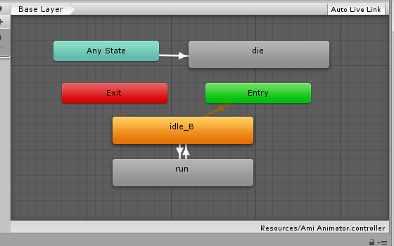
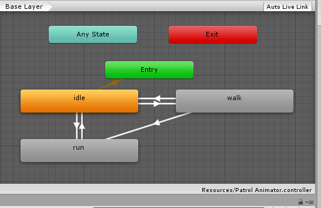
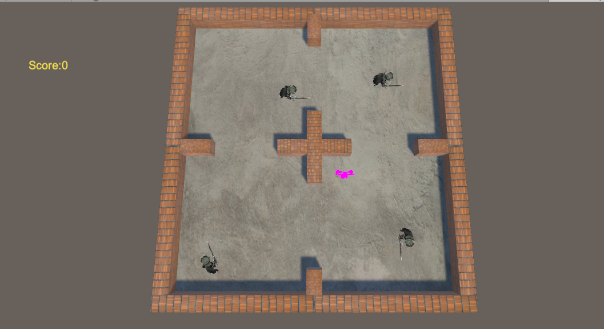

### 游戏简介

本次游戏任务为创建一个由玩家和部分巡逻兵组成的游戏，当玩家没有进入巡逻兵的有效发觉范围，巡逻兵一直做巡逻动作，当玩家进入范围就会朝玩家追逐，玩家逃脱之后重新进入巡逻状态，巡逻兵抓到玩家即游戏结束。

#### 游戏设计

首先还是要预制玩家的个体，并且用动画玩家跑、走，巡逻兵巡逻、追捕等动作，以及地板和墙体的预制。

#### 代码结构

代码还是和前几次作业一样需要采用动作的分离，需要用到动作管理器和场景管理器等，比如玩家四个方向的控制、被捕、撞墙等动作。

```c#
using System.Collections;
using System.Collections.Generic;
using UnityEngine;

[RequireComponent(typeof(Animator))]
[RequireComponent(typeof(CapsuleCollider))]
[RequireComponent(typeof(Rigidbody))]

public class ActorController : MonoBehaviour {

    private Animator ani;
    private AnimatorStateInfo currentBaseState;
    private Rigidbody rig;

    private Vector3 velocity;
    private float rotateSpeed = 15f;
    private float runSpeed = 7f;//7f似乎游戏简单了很多
    

    // Use this for initialization
    void Start () {
        ani = GetComponent<Animator>();
        rig = GetComponent<Rigidbody>();
    }

    // Update is called once per frame
    void FixedUpdate () {
        if (!ani.GetBool("isLive")) return;
        float x = Input.GetAxis("Horizontal");
        float z = Input.GetAxis("Vertical");

        ani.SetFloat("Speed", Mathf.Max(Mathf.Abs(x), Mathf.Abs(z)));
        // 设置速度
        ani.speed = 1 + ani.GetFloat("Speed") / 3;
        // 调整跑步的时候的动画速度

        velocity = new Vector3(x, 0, z);

        
        if (x != 0 || z != 0)
        {
            Quaternion rotation = Quaternion.LookRotation(velocity);
            if (transform.rotation != rotation) transform.rotation = Quaternion.Slerp(transform.rotation, rotation, Time.fixedDeltaTime * rotateSpeed);
        }

        this.transform.position += velocity * Time.fixedDeltaTime * runSpeed;
        // 主角移动
    }

    private void OnTriggerEnter(Collider other)
    {
        if (other.gameObject.CompareTag("Area"))
        {
            Debug.Log("into"+other.gameObject.name);//检测进入区域是否检测成功
            Publish publish = Publisher.getInstance();
            int patrolType = other.gameObject.name[other.gameObject.name.Length - 1] - '0';
            publish.notify(ActorState.ENTER_AREA, patrolType, this.gameObject);
            // 进入区域后，发布消息
        }
    }

    //触碰后死亡
    private void OnCollisionEnter(Collision collision)
    {
        if (collision.gameObject.CompareTag("Patrol") && ani.GetBool("isLive"))
        {
            ani.SetBool("isLive", false);
            ani.SetTrigger("toDie");
            // 执行死亡动作
            Publish publish = Publisher.getInstance();
            publish.notify(ActorState.DEATH, 0, null);
            // 碰撞后，发布死亡信息
        }
    }
}
```

同时在产生对象的时候也是用到工厂方法。

```c#
using System.Collections;
using System.Collections.Generic;
using UnityEngine;

public class ObjectFactory : MonoBehaviour
{

    private static List<GameObject> used = new List<GameObject>();//正在使用
    private static List<GameObject> free = new List<GameObject>();//空闲状态
    public void freeObject(GameObject oj)
    {
        oj.SetActive(false);
        used.Remove(oj);
        free.Add(oj);
    }
    // 此函数表示将物体放到一个指定位置，并且面向方向指定
    public GameObject setObjectOnPos(Vector3 targetposition, Quaternion faceposition)
    {
        if (free.Count == 0)
        {
            GameObject aGameObject = Instantiate(Resources.Load("prefabs/Patrol")
                , targetposition, faceposition) as GameObject;
            // 新建实例，将位置设置成为targetposition，将面向方向设置成faceposition
            used.Add(aGameObject);
        }
        else
        {
            used.Add(free[0]);
            free.RemoveAt(0);
            used[used.Count - 1].SetActive(true);
            used[used.Count - 1].transform.position = targetposition;
            used[used.Count - 1].transform.localRotation = faceposition;
        }
        return used[used.Count - 1];
    }

   
}
```

而UI的方面相对来说则比较简单。

**比较重要的必须使用订阅和发布传送消息：**

```c#
using System;
using System.Collections;
using System.Collections.Generic;
using UnityEngine;

public interface Publish
{
    void notify(ActorState state, int pos, GameObject actor);
    // 发布函数
    void add(Observer observer);
    // 委托添加事件
    void delete(Observer observer);
    // 委托取消事件
}

public interface Observer
{
    void notified(ActorState state, int pos, GameObject actor);
    // 实现接收函数
}

public enum ActorState { ENTER_AREA, DEATH }

public class Publisher : Publish {

    private delegate void ActionUpdate(ActorState state, int pos, GameObject actor);
    private ActionUpdate updatelist;
    // 委托定义

    //单例模式
    private static Publish _instance;
    public static Publish getInstance()
    {
        if (_instance == null) _instance = new Publisher();
        return _instance;
    }

    public void notify(ActorState state, int pos, GameObject actor)
    {
        if (updatelist != null) updatelist(state, pos, actor);
        // 发布信息
    }

    public void add(Observer observer)
    {
        updatelist += observer.notified;
    }

    public void delete(Observer observer)
    {
        updatelist -= observer.notified;
    }
}
```

**举个简单的例子就是，玩家每次完成一个动作，就发布一次消息，至于玩家完成这个动作需要干什么，不需要归玩家管理，这样才能更好维护，如果每个玩家上面都得绑定一个特殊的属性那样进行更改就会十分的麻烦，当然发布了消息会有专门的观察者来对收到的消息进行逻辑处理。**

#### 行为状态图

- 玩家



- 巡逻兵

  

#### 游戏截图



### **[代码和视频](https://github.com/iamcaiji/3d-game-programing/tree/master/hw7-%E6%99%BA%E8%83%BD%E5%B7%A1%E9%80%BB%E5%85%B5](https://github.com/iamcaiji/3d-game-programing/tree/master/hw7-智能巡逻兵))**

