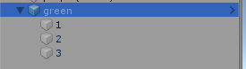
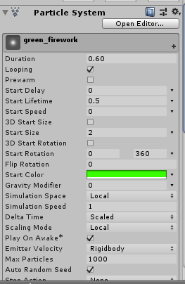
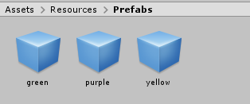
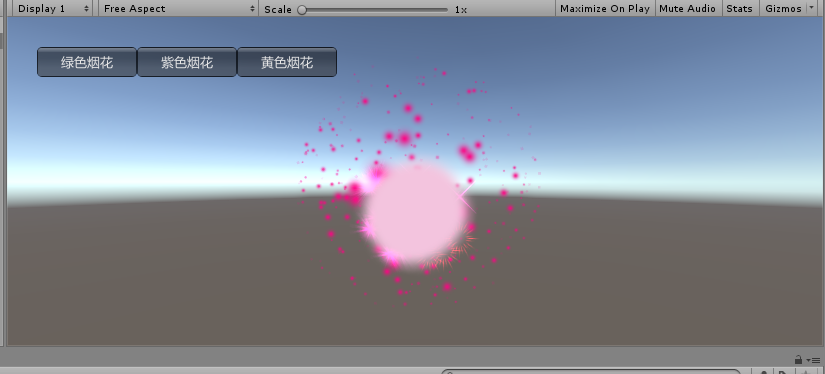

### 粒子系统

#### 预制

本次的内容是实现一个简单的例子系统，我觉得课件上的介绍已经教会我们对于例子系统的操作，虽然要选择的属性很多，但是真正要用到我们只要多用几下就熟悉了，比如说大小，起始颜色，随时间变化的颜色，随时间变化的大小，发射的频率，选择的形状，贴图等等，还是比较容易上手的。



这个是一个绿色烟花的层次结构。

- green是一个空对象，用于代码中的实例化资源
- 1是光圈外层
- 2是烟花中间的光点
- 3是烟花从中间往外飞的粒子



这是其中一些属性，这里就不细细讲了。把这个烟花弄成预制，然后又复制这个预制，创建两个其他烟花（只是改变一下颜色），然后又将他们预制，最终得到三个不同的预制。



#### 代码控制不同场景出现不同的烟花

```c#
using UnityEngine;
using System.Collections;

public class AAA : MonoBehaviour {

	public float t = 0f;

	public GameObject firework;
	public int count = 0;

	void Start() {
		firework = Instantiate(Resources.Load<GameObject>("Prefabs/green"), new Vector3(0, 0, 0), Quaternion.identity);
	}

	void OnGUI(){
		if (GUI.Button(new Rect(30,30,100,30), "绿色烟花")) {
			Destroy(firework);
			firework = Instantiate(Resources.Load<GameObject>("Prefabs/green"), new Vector3(0, 0, 0), Quaternion.identity);
		}
		if (GUI.Button(new Rect(130,30,100,30), "紫色烟花")) {
			Destroy(firework);
			firework = Instantiate(Resources.Load<GameObject>("Prefabs/purple"), new Vector3(0, 0, 0), Quaternion.identity);
		}
		if (GUI.Button(new Rect(230,30,100,30), "黄色烟花")) {
			Destroy(firework);
			firework = Instantiate(Resources.Load<GameObject>("Prefabs/yellow"), new Vector3(0, 0, 0), Quaternion.identity);
		}
	}
}
```

**运行时只要将这个脚本挂在摄像机和光线二者之一即可**，极其短而且简单的代码，这样就能控制烟花了，就是简单的实例化和销毁对象即可。最终截图：



这次作业相对简单，多希望每次都是这种作业啊。。。

#### 代码和视频

和该报告同一目录下！