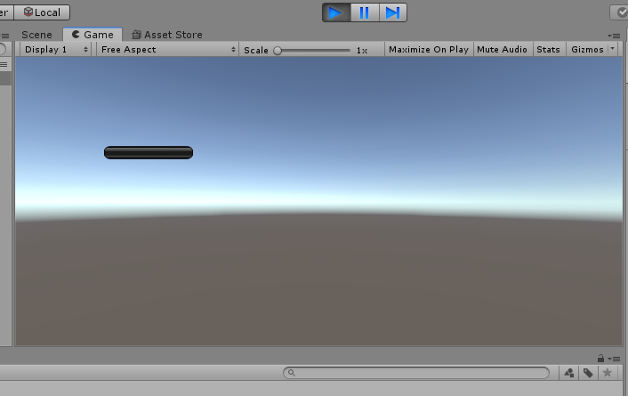
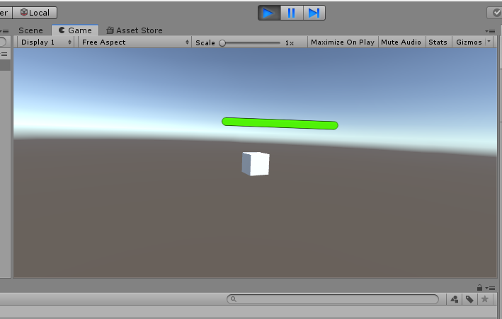

#### 题目

血条（Health Bar）的预制设计。具体要求如下

- 分别使用 IMGUI 和 UGUI 实现
- 使用 UGUI，血条是游戏对象的一个子元素，任何时候需要面对主摄像机
- 分析两种实现的优缺点
- 给出预制的使用方法

#### 实现过程

- IMGUI

  ```c#
  using System.Collections;
  using System.Collections.Generic;
  using UnityEngine;
  
  public class IMGUI : MonoBehaviour {
  
      private void OnGUI()
      {
          Vector3 worldPos = new Vector3(transform.position.x, transform.position.y, transform.position.z);
          Vector2 screenPos = Camera.main.WorldToScreenPoint(worldPos);
          Rect rect = new Rect(screenPos.x + 100,screenPos.y + 100 ,100,100);
          GUI.HorizontalScrollbar(rect, 0, 100, 0, 100);
      }
  }
  ```

  直接像GUI.Label、GUI.Button一样创建一个水平滚动条即可

  效果：

  

- UGUI

  ```c#
  using System.Collections;
  using System.Collections.Generic;
  using UnityEngine;
  
  public class UGUI : MonoBehaviour
  {
      // Start is called before the first frame update
      public GameObject cube;
      void Start()
      {
          cube = Instantiate(Resources.Load<GameObject>("Cube"), new Vector3(0, 1, 0), Quaternion.identity);
      }
  
      // Update is called once per frame
      void Update()
      {
          transform.RotateAround(new Vector3(0,1,0), new Vector3(1,3,0), 7 * Time.deltaTime);
      }
  }
  ```

  上面代码的作用是加载预制好的资源，然后让摄像机一直旋转，为了测试用。

  要求：血条必须随着摄像机移动而一直面向摄像机，直接使用课件代码:

  ```c#
  using System.Collections;
  using System.Collections.Generic;
  using UnityEngine;
  
  public class LookAtCamera : MonoBehaviour {
  
  	void Update () {
  		this.transform.LookAt (Camera.main.transform.position);
  	}
  }
  ```

  挂在到canvas画布上即可。

  

  效果见视频。

#### 优缺点比较

- IMGUI，实现很简单，很容易上手，但是维护起来不太简单，而且如果要实现变换那简直就是灾难。
- UGUI，所见即所得，支持多模式渲染，支持多摄像机等等，可以设计去比较炫酷的GUI，可是比较复杂，优秀的东西都是比较复杂的。。。

#### 如何使用预制

```c#
cube = Instantiate(Resources.Load<GameObject>("Cube"), new Vector3(0, 1, 0), Quaternion.identity);
```

简单使用如上。

#### 视频&代码

同目录下