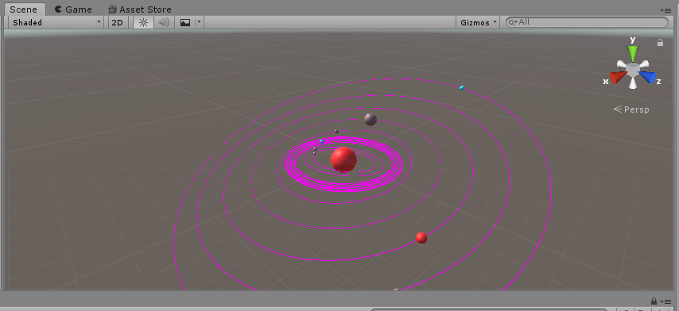
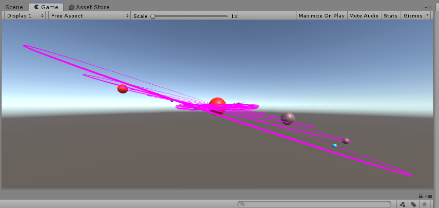
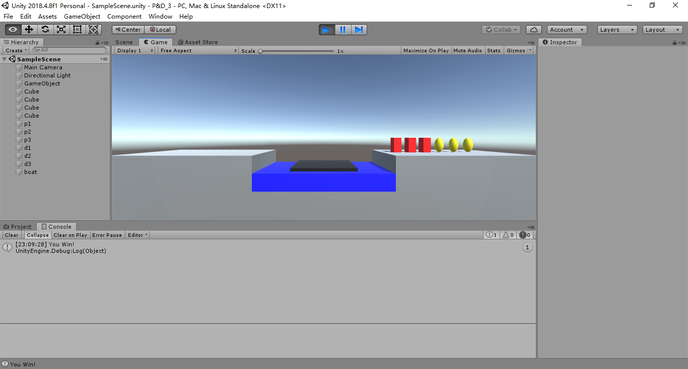

### 简单题

- 游戏对象运动本质是什么？
	就是使用矩阵变换（平移、旋转、缩放）改变游戏对象的空间属性。
	
- 请用三种方法以上方法，实现物体的抛物线运动。（如，修改Transform属性，使用向量Vector3的方法…）
	* 修改Transform属性
	```c#
	public class move : MonoBehaviour
	{
	    public GameObject ball;
	    public float speed_x;
	    public float speed_y; 
	    public float a;
	    // Start is called before the first frame update
	    void Start()
	    {
	        speed_x = 0.005f;
	        speed_y = 0;
	        a = 0.01f;
	    }

	    // Update is called once per frame
	    void Update () {
	        ball.transform.position = new 				Vector3(ball.transform.position.x + speed_x, 
	            ball.transform.position.y + speed_y, ball.transform.position.z);
	        speed_y += a * 0.001f; 
	    }
	}
	```
	* 使用向量vector3
	```c#
		public class move1 : MonoBehaviour
	{
	    public Vector3 speed_x, speed_y, a;
	    public GameObject ball;
	    // Start is called before the first frame update
	    void Start()
	    {
	        ball = GameObject.Find("Sphere");
	        speed_x = 0.005f * Vector3.right;
	        speed_y = Vector3.zero;
	        a = 0.01f * Vector3.up;
	    }

	    // Update is called once per frame
	    void Update()
	    {
	        ball.transform.position += speed_x;
	        ball.transform.position += speed_y;
	        speed_y += a * 0.001f;
	    }
	}
	```
	
	- 使用Rigidbody
	
	```c#
	public class Parabola3 : MonoBehaviour {
	
	    private Rigidbody rigid;
	    private Vector3 v0;
	
	    // Use this for initialization
	    void Start()
	    {
	        rigid = this.GetComponent<Rigidbody>();
	        v0 = new Vector3(3, 10, 0);
	        rigid.velocity = v0;
	    }
	
	    // Update is called once per frame
	    void Update()
	    {
	
	    }
	}
	```
	
- 写一个程序，实现一个完整的太阳系， 其他星球围绕太阳的转速必须不一样，且不在一个法平面上。

  代码如下：

  ```c#
  using System.Collections;
  using System.Collections.Generic;
  using UnityEngine;
  
  public class thesolarsystem : MonoBehaviour
  {
      // Start is called before the first frame update
      private GameObject sun, earth, moon;
      private GameObject Merkur, Venus, Mars, Jupiter, Saturn, Uranus, Neptun;
  
      void Start()
      {
          sun = GameObject.Find("sun");
          earth = GameObject.Find("earth");
          moon = GameObject.Find("moon");
          Merkur = GameObject.Find("Merkur");
          Venus = GameObject.Find("Venus");
          Mars = GameObject.Find("Mars");
          Jupiter = GameObject.Find("Jupiter");
          Saturn = GameObject.Find("Saturn");
          Uranus = GameObject.Find("Uranus");
          Neptun = GameObject.Find("Neptun");
      }
  
      // 自转
      void GameObjectRotation(){
          earth.transform.Rotate(new Vector3(3, 4, 0), 30 * Time.deltaTime);
          sun.transform.Rotate(new Vector3(3, 4, 0), 30 * Time.deltaTime);
          moon.transform.Rotate(new Vector3(3, 4, 0), 30 * Time.deltaTime);
          Merkur.transform.Rotate(new Vector3(3, 4, 0), 30 * Time.deltaTime);
          Venus.transform.Rotate(new Vector3(3, 4, 0), 30 * Time.deltaTime);
          Mars.transform.Rotate(new Vector3(3, 4, 0), 30 * Time.deltaTime);
          Jupiter.transform.Rotate(new Vector3(3, 4, 0), 30 * Time.deltaTime);
          Saturn.transform.Rotate(new Vector3(3, 4, 0), 30 * Time.deltaTime);
          Uranus.transform.Rotate(new Vector3(3, 4, 0), 30 * Time.deltaTime);
          Neptun.transform.Rotate(new Vector3(3, 4, 0), 30 * Time.deltaTime);
      }
  
      //公转
      void GameObjectRevolution(){
           Merkur.transform.RotateAround(sun.transform.position, new Vector3(-1,6,0), 61 * Time.deltaTime);
           Venus.transform.RotateAround(sun.transform.position, new Vector3(-1,7,0), 52 * Time.deltaTime);
           earth.transform.RotateAround(sun.transform.position, new Vector3(0,1,0), 43 * Time.deltaTime);
           Mars.transform.RotateAround(sun.transform.position, new Vector3(1,7,0), 34 * Time.deltaTime);
           Jupiter.transform.RotateAround(sun.transform.position, new Vector3(1,6,0), 22 * Time.deltaTime);
           Saturn.transform.RotateAround(sun.transform.position, new Vector3(1,5,0), 17 * Time.deltaTime);
           Uranus.transform.RotateAround(sun.transform.position, new Vector3(1,4,0), 11 * Time.deltaTime);
           Neptun.transform.RotateAround(sun.transform.position, new Vector3(1,3,0), 7 * Time.deltaTime);
           moon.transform.RotateAround(earth.transform.position, new Vector3(1,2,0), 7 * Time.deltaTime);
      }
  
      // Update is called once per frame
      void Update()
      {   
          GameObjectRotation();
          GameObjectRevolution();
      }
  }
  
  ```

  效果图：

  

  

  为了方便查看轨迹，直接对每一个对象加了一个组件，界面上点击Component->Effects->Trail Renderer，然后自己根据需要调整即可。

  图一可以看到他们的公转速度是不同的，图二可以看到他们是不同的法平面上的，图一中轨迹比较稠密的地方是地月系，可以看到月球也是围绕地球旋转的。

### 编程题



简单的动作：

- 开船 （可以一个人或者两个人）
- 上船
- 下船

MVC结构：

- Model：数据的基本格式，比如建立动态建立组件，船的状态人的状态等等

- View：用户点击和展示的模块，接受参数，展示效果

- Controller：逻辑处理的板块，连接View和Model，View点击传回的参数与Model的参数原型进行对比和处理，然后返回参数给View决定展示的效果。

[<https://github.com/iamcaiji/3d-game-programing/tree/master/hw_2>](！！！！代码&视频！！！！)

